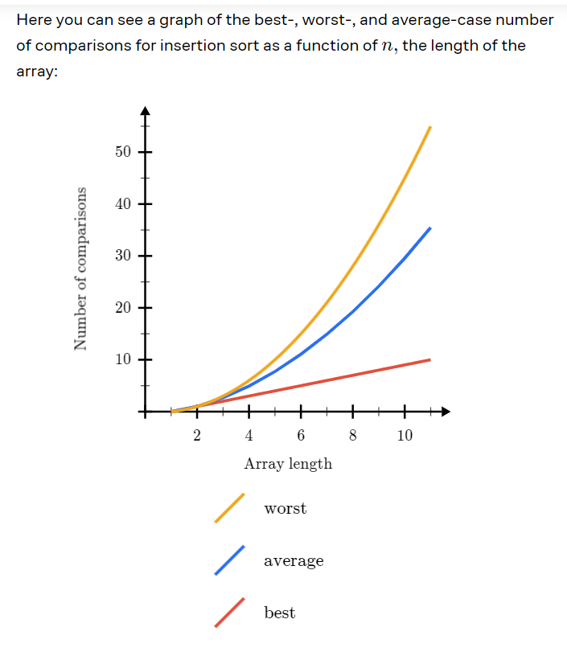

1. Binary search only works with the sorted arrays.
2. Eulerian path is a path which travels the edge only once
3. In graphs we have vertices (circular points) and the edges
4. A naming system in computer is composed of 3 parts
    1. Name (Eg. PLC)
    2. Value (Eg. Its IP is 192.168.1.1)
    3. Resolver (Eg. Its a process of matching the name with its value)
5. Algorithm and pseudo codes are very important for the programmers to think about the computation of the code without thinking about the programming language and the limitations of the computer that runs the code.
6. Divide and conquer is the important algorithm technique used by the programmers to divide the problem into half and deal with each sections separately.
7. In if-else loop structure the if the first condition is true then it will not check the rest of the condition and will get out of the condtion.
8. In loops the most repeatedly tasks are inner loops and the less repeatedly tasks are outside loops.
9. Think a problem a complete structure that can be repeated as a whole so that you can use loops correctly.
10. When we have main target the n put that in the while loop. The Rest of the conditional checks should be in the other case checkings like IF-ELSE condition.
11. langtons ant is a complex property of simple program that when a program reaches to 10,000 steps it starts to do something unique.
12. In problem solving technique finding out the most powerful information and starting with tha information is very important.
13. Learning different sorting array techniques helps us to make good 
in problem solving and analyse different solution based on the problem situation.
14. Selection sort scans the unsorted part of the array by doing scanning more and less swaps.
15. Insertion sort scans the sorted part of the array by doing less scanning and more swaps.
16. Insertion sort is more efficient than selection sort when the array is partially sorted.
17. While the selection sort is useful when the array is highly unsorted.
18. In general both have advantages and disadvantages.
19. The timing of the program is very important to understand. As we increase the size of the program the time increase parabolically.
20. The selection sort for (n) array elements does (n-1) swaps and (n^2-n)/2 comparisions and it is fixed.
21. Permutation means the ordering of elements
22. Formula for permutation is n!/(n-r)!: Eg: If there are 3 elements (1,2,3) then 6 orders

23. The algorithm design it is important to start simple. Then modify and generalize gradually to make it able to solve the real worl problem.

24. The deffered - accceptance algorithm (gale-shapley algorithm) is applied on hospital and candidate scenario in which both hospital and candidates have a list of candidates and hospitals for priority selection. 

25. First the hospital makes an offer and then candidates makes a decision. Candidates can also hold one offer and wait for another offer from the hospital.

26. Algorithm works does not mean it will produce a correct result for every type of input.

27. The algorithm must work on some cases and some not.

28. When the algorithm has a loop then a programmer needs to find a condition where it get out of the loop to move ahead.

29. When designing the algorithm you might use loops to control something.

30. It is important that look for some parameters that become smaller or larger to conclude the algorithm on something.
