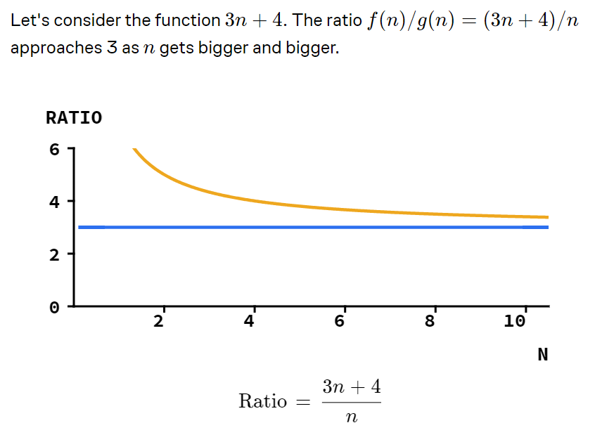

1. The running time of an alogrithm changes with the input to which put the algorithm in best, average, or worst case sceanario.
2. The average case of both insertion and selection sort is n2. 
3. Suppose we are testing the speed of both algorithms. We use the array of length 100 in different order and found that insertion sort is 10 times faster than selection sort. So if we increase the length of array to 10,000 then the results will be the same that is it will be 10 times faster.
4. Suppose we tweak the implementation of these algorithm then now the selection sort is twice faster than insertion sort. Now if we increase the length of the array to 10,000 then selection sort will be faster.
5. Now suppose we have an another alogrithm called mystery sort which which has the average case cost 15*n3/2.
6. Now we are comparing selection sort with this new mystery sort and found that mystery sort is 5 times faster than the selection sort. Now if we increase the length of the array to 10,000 then mystery sort will win.
7. Now we have done some modifications in the selection sort so now it is twice as faster than the mystery sort.
8. If we increase the size of the array 10,000 then which sorting algorithm will be faster. Have a look to the calculation below.

9. Below are some immportant graphs need to be considered.

10. Algorithms from faster to lower notations:
n>n2>n3/2

11. Mystery sort is faster than insertion sort only if the array is not already sorted.

12. If a selection sort is called inside a for loop which means it is called n time. So as we know that the time complexity of selection sort is n2 then it would become n3.

13. This graph sows the running time cost of the step function. The step function are not polynomial function. 

14. This graph shows that the step function is "bound above" by another polynomial function so now its cost is O(n2). The step function are not polynomial but still we want to give it a big O cost. So as it is bounded above by the polynomial O(n2) so step function cost is also O(n2).

15. If the certain algorithm runs in time ck^3 on the array of length k2 so when the length of the array is not perfect square then the algorithm expands the length of the array to make it perfect square.

16. The following image shows the collection of big O notation that are bound from above.

17. The following image shows the collection of 3 functions that are bound from the above by the blue function.

18. The image below shows that only 1 out of 2 functions comes under the O(n^2) which is 2n2+100

19. The mathematical definition of big O is the following: The f(n) is in the set of O(g(n)) if the ratio of f(n)/g(n) is under some constant value C.

20. The two example for this are as follows:

21. The ratio 2n/&radic;n grows without bound so 2n is not in O(&radic;n). Whereas &radic;n/2n approaches 0 so it is in O(2n)
