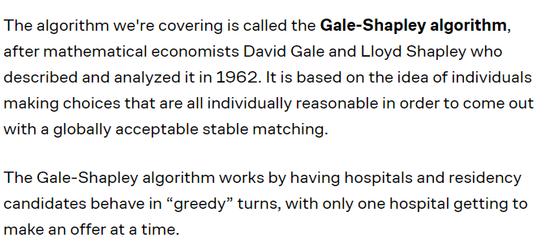
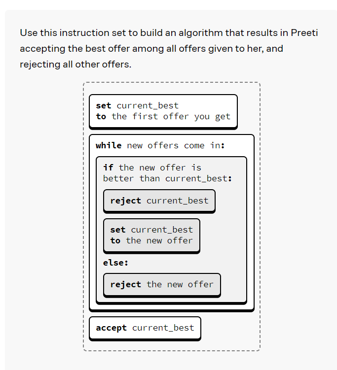
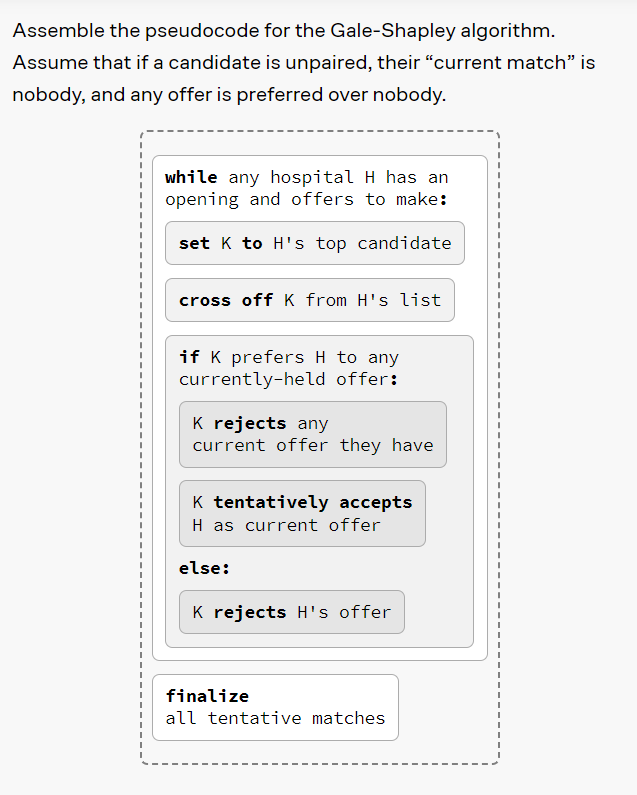

1. The algorithm design it is important to start simple. Then modify and generalize gradually to make it able to solve the real worl problem.

2. The deffered - accceptance algorithm (gale-shapley algorithm) is applied on hospital and candidate scenario in which both hospital and candidates have a list of candidates and hospitals for priority selection. 

3. First the hospital makes an offer and then candidates makes a decision. Candidates can also hold one offer and wait for another offer from the hospital.

4. Defection means to match up.