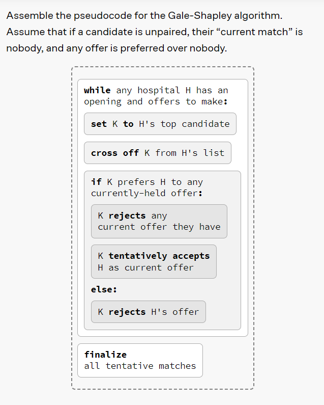
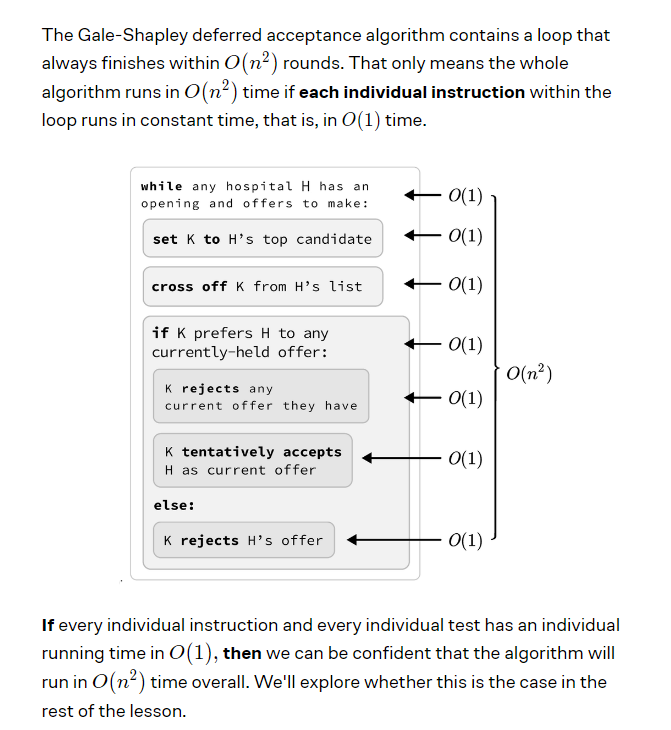
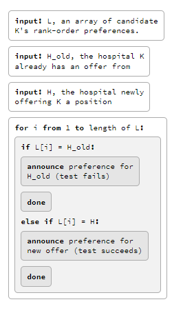
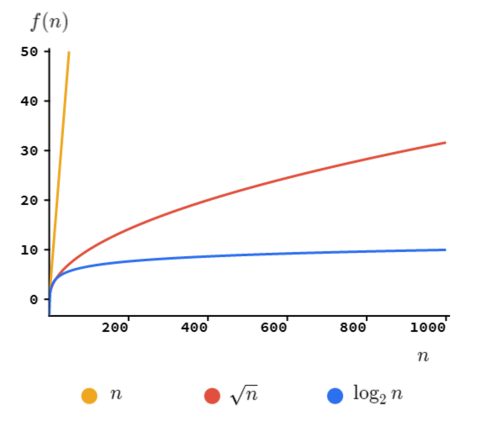
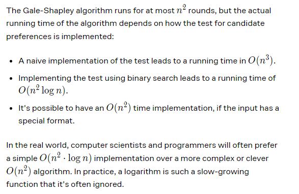

1. Gale-Shapley algorithm is used for stable matching algorithm as we discussed on the 4_Making_Priorites.md.

2. An algorithm can be implemeted by different methods and can produce same results but the running time matters.

3. The running time of the algorithm is described by big O notation.

4. As the processing speed of the processor differs so the computer scientist want to check that how the alogorithm will run in how much time.

5. The gale-shapley algorithm is defined below

6. This algorithm has 2 entities: 1 is hospital H and another is candidate K.

7. If there are (n) hospitals and (n) candidates then the worst case running rounds of the algorithm will be n2

8. We can not say anything about the running time of the algorithm if we dont know anything about the how much time it takes to run 1 command (instruction).

9. If the ruuning time of the single instruction is O(1) then we can say that the running time of the algorithm is under O(n2) if the total rounds of the algorithm are in O(n2).

10. Another scenario is if the candidate has an array that describe the list of preference of the hospital names (L) then the algorithm will have the time for the algorithm in O(n).

11. The step testing of the line which is "If K prefers H to any currrently held offer" can be done by doing the binday search.

12. For example each each candidate has an array of preference of hospitals.

13. There will be n checks in binary search for 2n elements.

14. If we opposite the last statement then there will be log2n checks for n elements.

15. This graph shows that in log case as number of  elements increases the number of checks grows slowly.

16. So the binary search big O is O(log2n)

17. The overall time complexity big O for Gale Shapley algorithm is O(n2.log2n)

18. Let's look at yet another implementation. Suppose that instead of the hospitals having names, they were identified by consecutive serial numbers — starting at 0, the same way we index arrays.

19. Since the hospitals have numbers, her preference list could equally well be expressed as an array of ranks, as shown here. To be clear the indices of the array are the hospital numbers, and the contents of the array are Preeti's ranks for the corresponding hospitals.

20. The algorithm will run in O(n2).

21. The following is the important information to look into.

