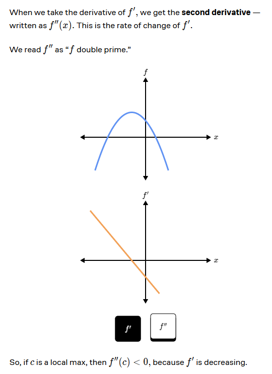
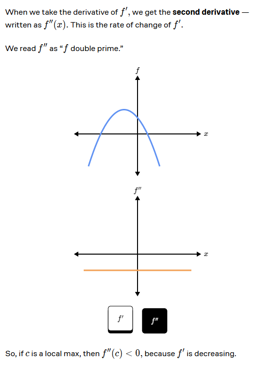
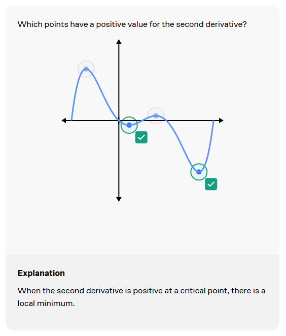
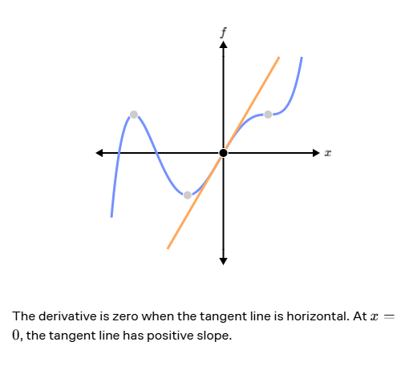
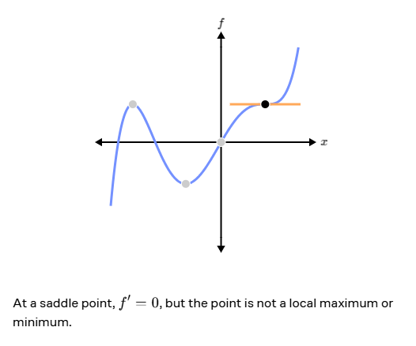
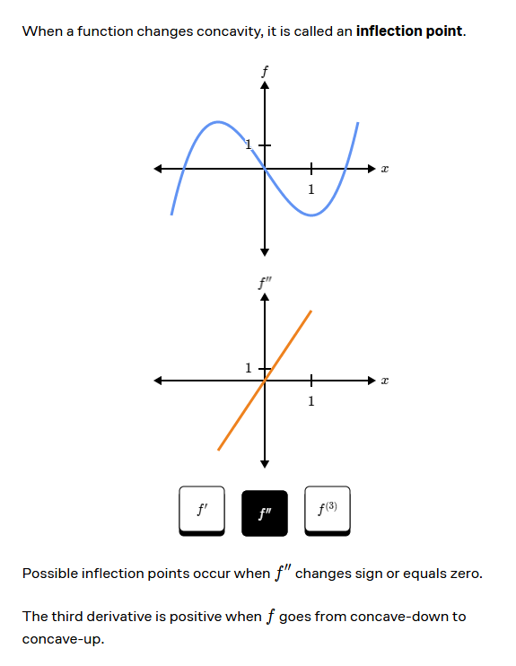
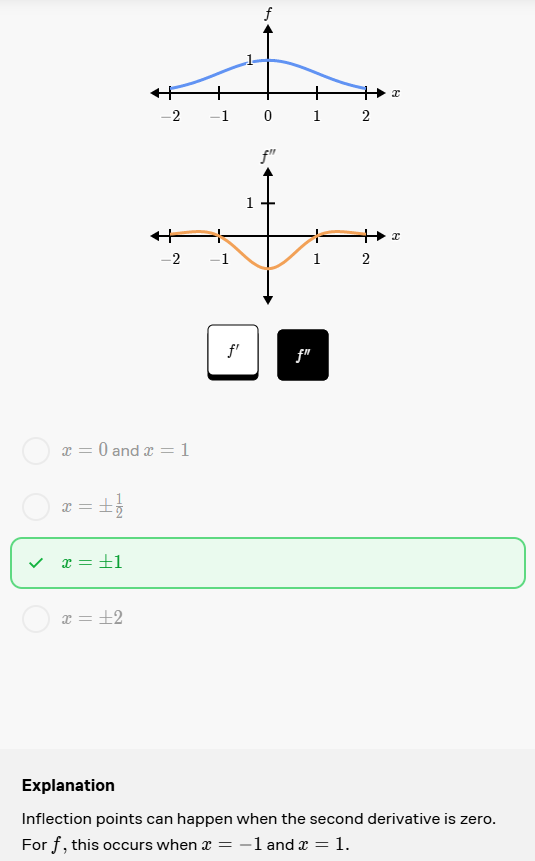
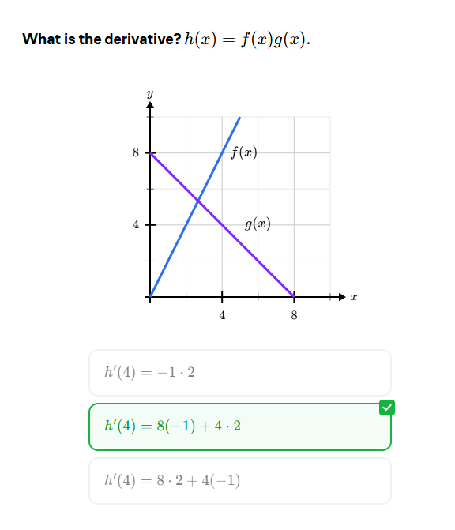

1. Calculus is the mathematics of change.
2. For a linear function it is easy to find the rate of change by just looking at the slope of the function.
3. When the function is a non-linear function then we can break down that function into small pieces and that will look like a LINE. That is if we zoom into the non-linear function until it looks like a linear function.
4. So we make it linear. Now to investigate the rate of change we use the secants (secants are the lines).
5. If that line best approximates any cureve then we can get the rate of the change by calculating the slope of the that line.
6. The derivative of a function is the rate of change (also known as slope of the function).
7. For non-linear function we take out the derivative which is the slope of the function.
8. The derivate has the minima and the maxima of which are the limits.
9. In the function we have local minimum or local maximum values. 

10. In an example of the dropping a phone from a height, it drops with an instataneous velocity which means that the height changes with the time.

11. 

12. 

13. 

14. To find the local minimum and maximum points we can do second derivative test. 

15. Follow the following steps to find it:
    1. First do the single derivate.
    2. Then equate them equal to zero to find the value of x.
    3. Then do second derivative to and put the values of x that you have found using first derivative.
    4. Then if you find -ve value then there is local maximum
    5. Then if you find +ve value then there is local minimum
    6. If we put x = 0 in the double derivate and we get 0 then it is a saddle point which means we do not know if it is the local minimum or maximum.

16. The second order derivate of the point is the powerful tool to determine the of the critical points are the local minimum or the maximum. But still it does not do all the work to determine it.

17. Saddle point explaination below

18. When the function changes its conacvity it is called inflection point.

Here is the example of the inflection point when the second derivative chnages its direction from negative to positive then the main function changes from the concave down to concave up.

19. From DISTANCE TO JERK is the path from 0th order derivative to 3rd order derivative.

