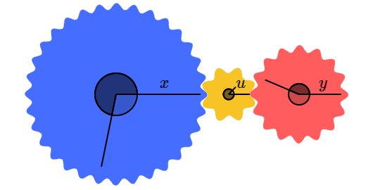
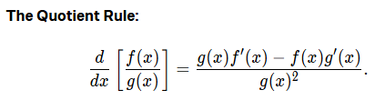

### The following are the different rules to find the derivative.

1. The constant multiple rule is the following.

2. The sum rule of the derivative is very simple. If there are two functions f(t) and g(t) then the sum of the derivative are f'(t) + g'(t).

3. For the product rule we consider the a sqaure with area x2. Now if we stretch the square to increase its length from x to x + Δx. 

4. Then the area of the square will be (x + Δx)2.

5. Here we can write the area as A = x2 when there is not increase in the area.

6. When there is increase in the area then the change in the area can be given as ΔA = 2xΔx + Δx2.

7. The product rule is given as 

8. A simple example is given as

9. Another rule to find the derivative is the chain rule.

10. So changing the angle of x changes the u angle and then changing the angle of u changes the angle of y.

11. dy/du and du/dx

12. So if we consider the point travelling on the gear then the distance can be calculated as radius * angle.

13. The velocity (speed) can be given as the change in distance per time. So it is given as 

14. The chain rule helps to find the derivatives of the composition.

15. It is given as (f o g)(x) = f(g(x))

16.  

17. Below is the example.

 

17. Now we have the quotient rule.

18. It is also called division rule.

 

19. Now lets discuss the optimization application.

20. If we have a coffee brewing equation in time domain.

 

21. Now we have to find the value of (t) where there is no change in the brewing function.

22. So first we do the derivative of the function and then equate it to zero to find at what time there is no change in the brewing function.

23. So we derivate and equate is to zero and found the value of t = 3.16

