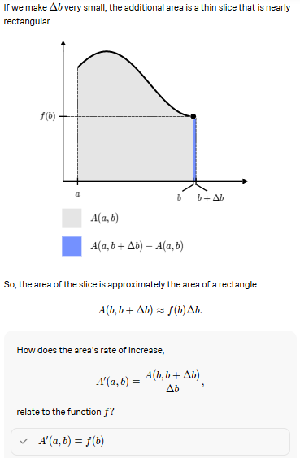
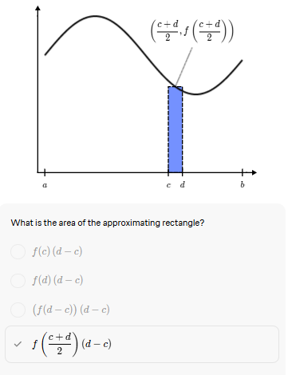
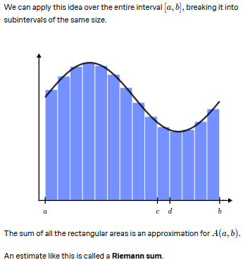
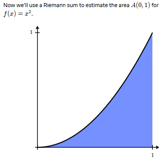
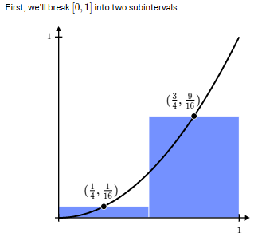
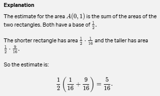

1. Finding the area is the next problem to solve.

2. If we have a curve function on the x - y plane then we can find the area under the curve by taking 2 points on the x - axis and it will be like A(0, b) so point a is at 0. 

3. So to find where the area increases faster is the point where the function value increase faster.

4. The rate of change in the area is given as A'(b, b+Δb)/Δb

5. If we make the Δb so small then the we can say that area is f(b)

6. Another way to find the area is the Riemann Sums.

7. In the Riemann Sums we have small rectangles that makes up the whole area in the area under the curve function.

8. For the height of the rectangle we can use the mid-point and the bredth we know.

9. So the area of the rectangle will be given as

10. So we can apply this estimate and it is called Riemann sum.

11. Now below is the example of the calculation for area of the function x2

